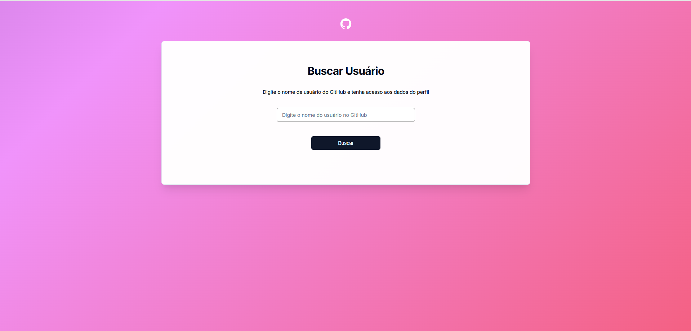
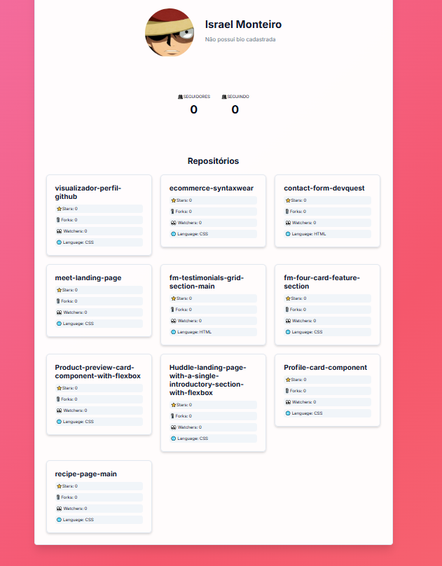

# 🔍 GitHub Profile Insight


A responsive GitHub profile explorer built with Vanilla JavaScript that consumes the GitHub REST API to display real-time user data, repository statistics, and profile insights.

Developed during the DevQuest Front-end course, this project focuses on practical JavaScript concepts such as API consumption, asynchronous programming, DOM manipulation, and responsive UI development.

---

## 🔗 Links

- Repository: https://github.com/israel-monteiro/visualizador-perfil-github.git

---

## 📸 Preview

### Desktop Preview



---

## ✨ Features

- Real-time GitHub API integration
- Search users by username
- Search using button click or `Enter` key
- Dynamic profile rendering
- Display avatar, bio, followers and following
- Show the 10 most recently updated repositories
- Repository statistics:
  - ⭐ Stars
  - 🍴 Forks
  - 👀 Watchers
  - 🌐 Main language
- Fully responsive interface

---

## 🎯 Project Goal

This project was built to strengthen practical front-end development skills, focusing on:

- API consumption with JavaScript
- Asynchronous programming using `async/await`
- DOM manipulation
- Modular code organization
- Responsive interface development
- User interaction and event handling

---

## 🛠️ Tech Stack

- HTML5
- CSS3
- JavaScript (ES6+)
- GitHub REST API
- DevIcons

---

## 📂 Project Structure

```text
github-profile-insight/
├── index.html              # Entry point & base layout
├── README.md               # Documentation
└── src/
    ├── css/                # Styling Layer
    │   ├── animations.css  # UI Transitions & keyframes
    │   ├── reset.css       # Cross-browser consistency
    │   ├── responsive.css  # Media queries & breakpoints
    │   └── styles.css      # Core component styles
    └── js/                 # Logic Layer (Modular)
        ├── githubApi.js    # Data fetching & API service
        ├── profileView.js  # DOM Manipulation & UI rendering
        └── index.js        # Event orchestration & app bootstrap
```
---

## 🚀 Getting Started

### Prerequisites
- A modern web browser (Chrome, Firefox, Edge, Safari).
- A local server (optional but recommended, e.g., VS Code Live Server).

### Installation
1. **Clone the repository:**
   ```bash
   git clone https://github.com/israel-monteiro/visualizador-perfil-github.git
   ```
2. **Navigate to the directory:**
   ```bash
   cd visualizador-perfil-github
   ```
3. **Launch the application:**
   - Simply open `index.html` in your browser, or use a local server extension.

---

## 🧠 Key Learnings

During the development of this project, I practiced and improved skills such as:

- Asynchronous JavaScript with `async/await`
- API consumption using `fetch`
- DOM manipulation and dynamic rendering
- Modular code organization
- Responsive interface development
- User interaction and keyboard events handling

---

## 🗺️ Future Improvements

- [ ] Add dark mode
- [ ] Add repository filters
- [ ] Add language statistics charts
- [ ] Improve loading and error states
- [ ] Add GitHub OAuth authentication

---

## 📚 Course Context

This project was developed during the DevQuest Front-end course as part of practical studies focused on JavaScript, REST APIs, and responsive interface development.

---

## 👤 Author

**Israel Monteiro**
- GitHub: [@israel-monteiro](https://github.com/israel-monteiro)

---

Developed with ☕ and passion for Front-end Development.